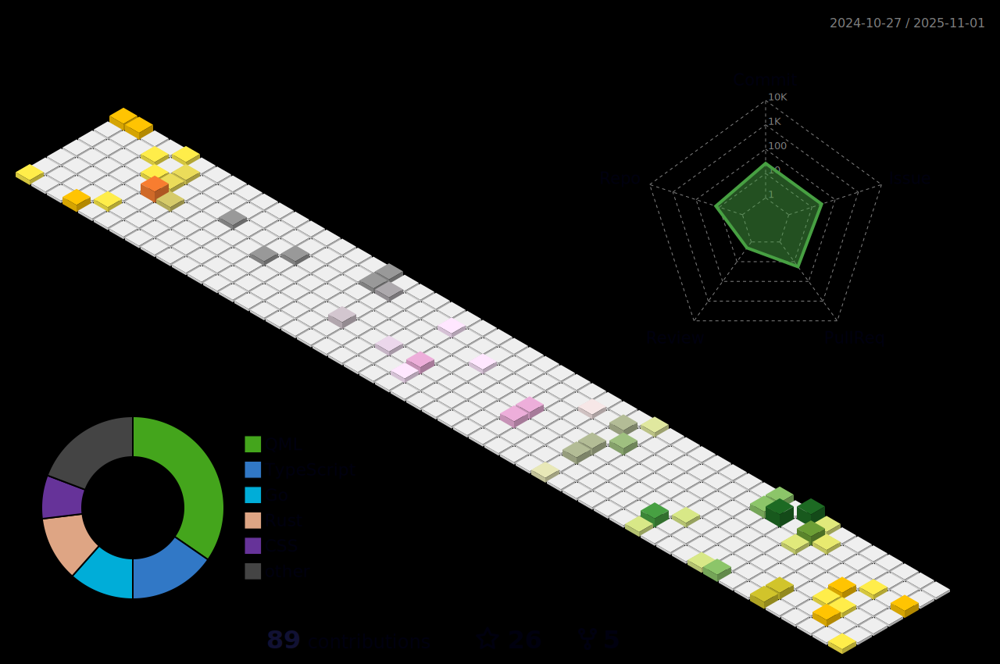

# Welcome

Hi there 👋

I'm an engineer with a passion for building things and solving problems. I'm currently working as a developer + tech innovator at [**@Fountlab**](https://fountlab.io/). I have a strong interest in cloud computing, distributed systems, and artificial intelligence. I'm also a big fan of open-source software and I try to contribute to the community as much as I can.

 

<!--
## 🌐 Socials

 

## 🏆 GitHub Trophies

<picture>
<source
  srcset="https://github-profile-trophy.vercel.app/?username=sansmoraxz&theme=radical&no-frame=true&no-bg=true&column=-1"
  media="(prefers-color-scheme: dark)"
/>
<source
  srcset="https://github-profile-trophy.vercel.app/?username=sansmoraxz&theme=flat&no-frame=true&no-bg=true&column=-1"
  media="(prefers-color-scheme: light), (prefers-color-scheme: no-preference)"
/>

</picture>

 

## 💻 Tech Stack

#### Languages I know

  
  
  
  
  

#### Cloud Platforms I worked in

  
  

#### Tools I am comortable using

  
  
  

#### What I used in Javascript

  
  
  
  
  

#### What I know in Java

  
  
  
  
  
  

#### Database I worked with

  
  
  
  

#### Cloud Native tools I like

  
  
  
  
  

  
  
  
  

#### Operating System I prefer

  
  

 

## 📊 GitHub Stats

<picture>
<source
  srcset="https://github-readme-stats.vercel.app/api?username=sansmoraxz&theme=radical&bg_color=00000000&hide_border=true&include_all_commits=true&count_private=true&show_icons=true"
  media="(prefers-color-scheme: dark)"
/>
<source
  srcset="https://github-readme-stats.vercel.app/api?username=sansmoraxz&theme=default&bg_color=00000000&hide_border=true&include_all_commits=true&count_private=true&show_icons=true"
  media="(prefers-color-scheme: light), (prefers-color-scheme: no-preference)"
/>

</picture>

 

<picture>
<source
  srcset="https://github-readme-streak-stats.herokuapp.com/?user=sansmoraxz&theme=radical&background=00000000&hide_border=true"
  media="(prefers-color-scheme: dark)"
/>
<source
  srcset="https://github-readme-streak-stats.herokuapp.com/?user=sansmoraxz&theme=buefy&background=00000000&hide_border=true"
  media="(prefers-color-scheme: light), (prefers-color-scheme: no-preference)"
/>

</picture>

 
-->

<picture>
<source
  srcset="profile-3d-contrib/profile-transparent-radial.svg"
  media="(prefers-color-scheme: dark)"
/>
<source
  srcset="profile-3d-contrib/profile-transparent-season.svg"
  media="(prefers-color-scheme: light), (prefers-color-scheme: no-preference)"
/>

</picture>

 

   
✍️ Random Dev Quote

  
    

   <picture>
      <source
      srcset="https://quotes-github-readme.vercel.app/api?theme=dark&type=horizontal"
      media="(prefers-color-scheme: dark)"
      />
      <source
      srcset="https://quotes-github-readme.vercel.app/api?theme=light&type=horizontal"
      media="(prefers-color-scheme: light), (prefers-color-scheme: no-preference)"
      />
      
   </picture>

<!-- Proudly created with GPRM ( https://gprm.itsvg.in ) -->

